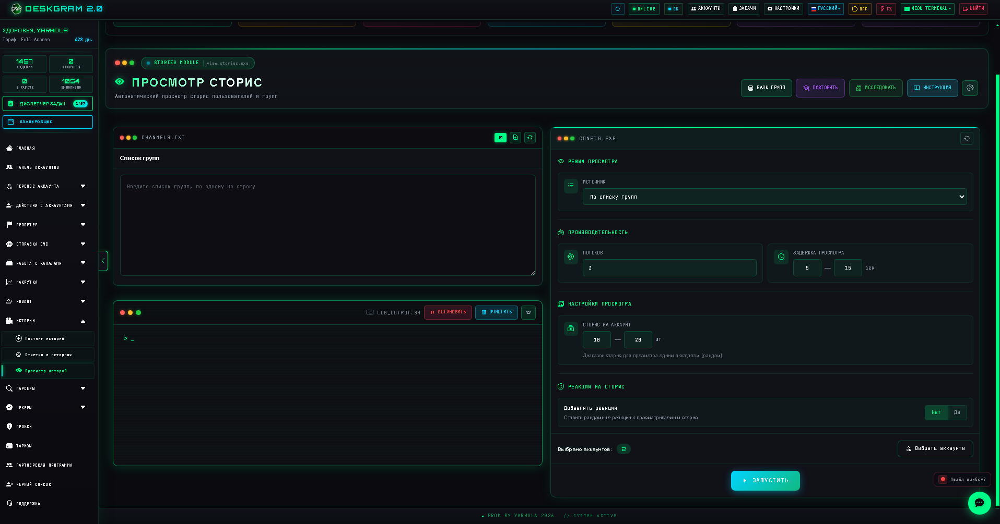
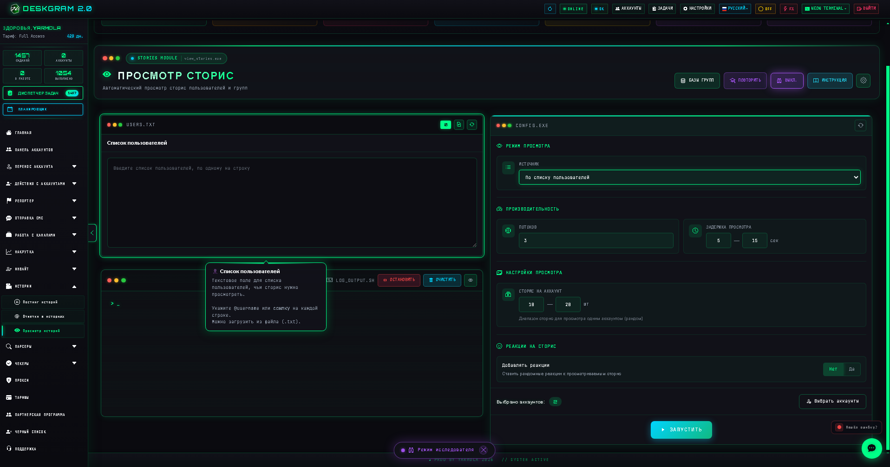
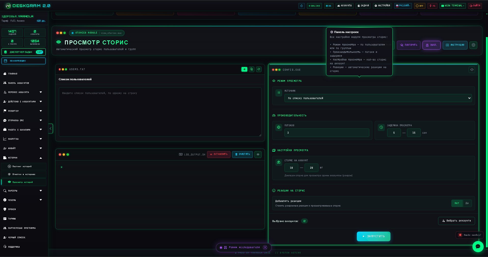
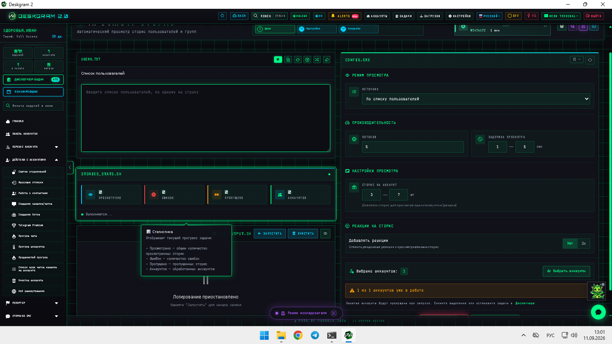

# Просмотр сторис в Telegram через Deskgram 2

Просмотр сторис в Deskgram 2 помогает массово запускать stories-активность по спискам пользователей или групп. Модуль полезен, когда просмотр сторис нужен как отдельный рабочий слой: для поддержки активности аккаунтов, мягкого охвата и stories-сценариев в масштабе.

[Главный хаб Deskgram 2](https://github.com/Deskgram-2/deskgram-2-telegram-automation) · [Сайт](https://deskgram2.com/) · [Telegram-бот](https://t.me/DG2welcomebot) · [Web preview](https://deskgram2.com/web-preview?path=%2Fapp-demo%2F&lang=ru)
## Интерактивный Web Preview

Попробовать модуль в браузере: [Открыть веб-превью](https://deskgram2.com/web-preview?path=%2Fapp-demo%2Ffunctions%2Fview_stories&lang=ru)

## Скриншоты

## Кратко о модуле

| Параметр | Что внутри |
|---|---|
| Основная задача | Массовый просмотр Telegram-сторис пользователей и групп |
| Важные блоки | Источники пользователей/групп, режим просмотра, performance, реакции, статистика |
| Полезен для | Stories-активности, прогрева, мягкого охвата, поддержки живой сетки аккаунтов |
| Связанные модули | Прогрев аккаунтов, отметки в сторис, аккаунты, диспетчер задач |

## Что умеет модуль

- работать по спискам пользователей или групп;
- задавать режим просмотра и рабочие лимиты;
- управлять потоками, задержками и количеством историй;
- добавлять реакции как часть stories-активности;
- показывать статистику по просмотрам, ошибкам и пропускам.

## Быстрый старт

1. Выберите источник: пользователи или группы.
2. Подготовьте список для просмотра сторис.
3. Настройте потоки, задержки и объем на аккаунт.
4. При необходимости включите реакции.
5. Запустите задачу и следите за статистикой выполнения.

## Куда эта цепочка обычно ведет дальше

- [Прогрев аккаунтов](https://github.com/Deskgram-2/telegram-account-warmup-deskgram), если stories-активность используется как часть мягкой подготовки аккаунтов;
- [Отметки в сторис](https://github.com/Deskgram-2/telegram-story-mentions-deskgram), если после просмотра нужен уже активный stories-охват со своей публикацией;
- [Панель аккаунтов](https://github.com/Deskgram-2/telegram-account-manager-deskgram), если аккаунты нужно разводить по группам и контролировать загрузку;
- [Настройки](https://github.com/Deskgram-2/telegram-automation-settings-deskgram), если нужно унифицировать системные параметры;
- [Диспетчер задач](https://github.com/Deskgram-2/telegram-task-manager-deskgram), если stories-задачи должны идти в одном операционном потоке с остальными сценариями.

## Как устроен сценарий

### Источники просмотра

Модуль умеет работать по спискам пользователей и по спискам групп. Это полезно, когда stories-активность строится либо вокруг конкретных людей, либо вокруг более широких сообществ.

### Режимы и ограничения

Параметры задержек, количества историй и потоков помогают задавать темп без ручного контроля каждой операции.

### Реакции и контроль результата

Дополнительные реакции усиливают stories-сценарий, а stats/log panel позволяют быстро оценивать итог и замечать ошибки.

## Когда особенно полезен

- когда stories-просмотры нужны как слой активности по аккаунтам;
- когда вы строите мягкий охват без прямой коммуникации;
- когда stories-задачи нужно запускать пакетно;
- когда ручной просмотр сторис перестает быть управляемым.

## Почему это удобнее ручного просмотра сторис

| Ручной подход | Просмотр сторис в Deskgram 2 |
|---|---|
| Нужно вручную ходить по каждому аккаунту и списку | Один сценарий работает по готовой базе |
| Тяжело повторять одинаково на масштабе | Есть параметры, режимы и лимиты |
| Сложно понять итоговый объем | Есть статистика по просмотрам и ошибкам |
| Stories-активность выпадает из общего контура задач | Модуль удобно связывается с другими сценариями |

## Сценарии применения

### Сценарий 1. Мягкая stories-активность по аккаунтам

Если не нужен резкий переход к outreach, а требуется более мягкий activity-слой, story viewer хорошо работает как инфраструктурный и поведенческий модуль.

### Сценарий 2. Stories-слой после прогрева

После [прогрева аккаунтов](https://github.com/Deskgram-2/telegram-account-warmup-deskgram) просмотр сторис можно использовать как следующий более живой, но все еще аккуратный сценарий активности.

### Сценарий 3. Support-модуль для stories-цепочки

Если вы уже публикуете истории, story viewer помогает усилить stories-направление и разложить его на несколько сценариев: публикация, просмотры, реакции и дальнейший контроль через задачи.

## Что выбрать: просмотр сторис или отметки в сторис

| Если задача такая | Лучше использовать |
|---|---|
| Нужно смотреть stories и добавлять reactions как activity-layer | [Просмотр сторис](https://github.com/Deskgram-2/telegram-story-viewer-deskgram) |
| Нужно публиковать собственные stories с медиа и отметками | [Отметки в сторис](https://github.com/Deskgram-2/telegram-story-mentions-deskgram) |
| Нужна мягкая активность без собственной публикации | Story viewer |
| Нужен stories-охват как отдельный канал | Story mentions + story viewer |

## Что выбрать: просмотр сторис или прогрев аккаунтов

| Если задача такая | Лучше использовать |
|---|---|
| Нужен stories-layer как отдельная активность по базе | [Просмотр сторис](https://github.com/Deskgram-2/telegram-story-viewer-deskgram) |
| Нужно более широко и мягко подготовить аккаунты к дальнейшей нагрузке | [Прогрев аккаунтов](https://github.com/Deskgram-2/telegram-account-warmup-deskgram) |
| Нужен мягкий маршрут `прогрев -> stories -> другие действия` | Сначала прогрев, затем просмотр сторис |
| Нужна только stories-активность без общего warmup-сценария | Просмотр сторис |

## Смежные репозитории

- [Главный хаб Deskgram 2](https://github.com/Deskgram-2/deskgram-2-telegram-automation)
- [Прогрев аккаунтов](https://github.com/Deskgram-2/telegram-account-warmup-deskgram)
- [Отметки в сторис](https://github.com/Deskgram-2/telegram-story-mentions-deskgram)
- [Панель аккаунтов](https://github.com/Deskgram-2/telegram-account-manager-deskgram)
- [Диспетчер задач](https://github.com/Deskgram-2/telegram-task-manager-deskgram)

## FAQ

### Здесь можно смотреть сторис не только пользователей, но и групп?

Да. В модуле предусмотрен выбор источника, поэтому stories-активность можно строить под разные типы баз.

### Реакции тоже входят в этот сценарий?

Да. Просмотр может идти не как полностью пассивный слой: при необходимости модуль поддерживает реакции как часть stories-активности.

## FAQ для рабочих сценариев

### Когда просмотр сторис лучше использовать как самостоятельный модуль?

Когда stories-активность сама по себе уже решает задачу: поддерживает живость сетки, создает мягкий activity-layer и не требует немедленного перехода в более прямую коммуникацию.

### Когда после просмотра сторис логичнее идти в stories-публикацию, а не в другие модули?

Когда вы строите именно stories-цепочку, а не общий outreach-маршрут. Тогда [отметки в сторис](https://github.com/Deskgram-2/telegram-story-mentions-deskgram) становятся следующим логичным шагом.

### Что сильнее всего влияет на stories-view сценарий?

Чаще всего это качество базы пользователей или групп, темп выполнения, уместность реакций и то, встроен ли stories-layer в общую поведенческую стратегию аккаунтов.

